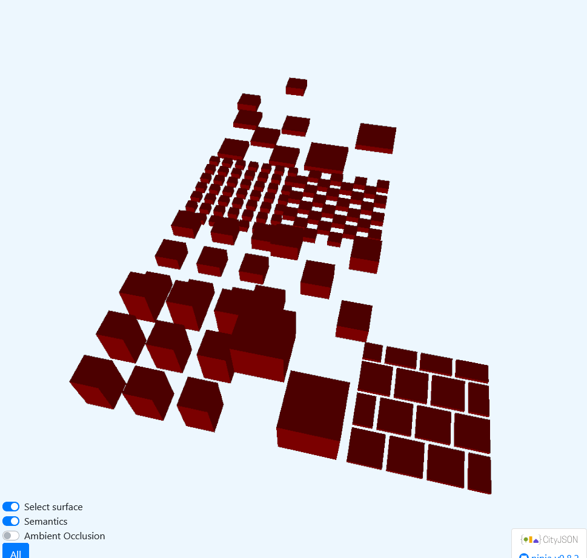

# Generate CityJSON

This is a small side quest to try and convert local climate zone (LCZ) raster maps to CityJSON in order to render them in 3D.

- Run the script with `python3 generator.py`.
- Validate by uploading `test.city.json` to https://validator.cityjson.org/
- Render in Ninja web viewer: https://ninja.cityjson.org/#
- Compare to [3dbag viewer](https://3dbag.nl/en/viewer?rdx=125691.20342463444&rdy=485509.3760868434&ox=-1829.5717134937004&oy=2303.2675256783377&oz=-1508.918937586117&placeMarker=true)

So far I'm able to reproduce (to some extent) the prototypes from [paper](https://www.sciencedirect.com/science/article/abs/pii/S0034425723001244):

Reference             |  Reproduced in CityJSON
:-------------------------:|:-------------------------:
 | 
 | 
 | 
 | 